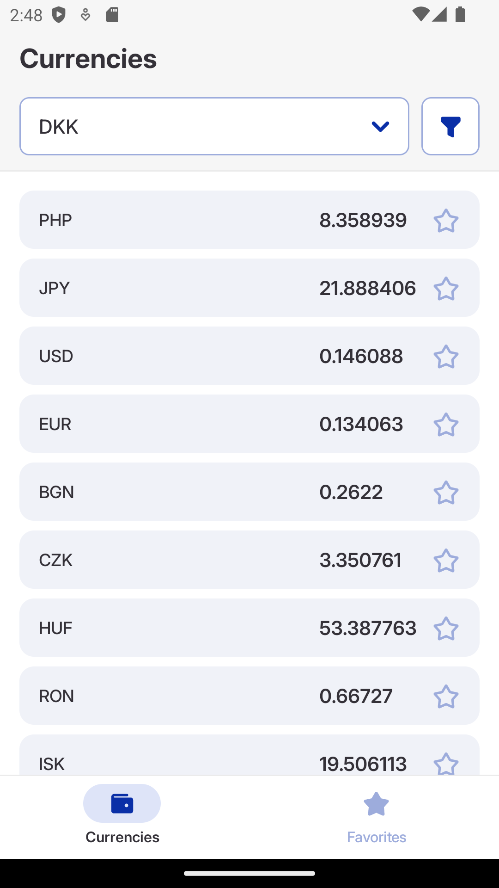
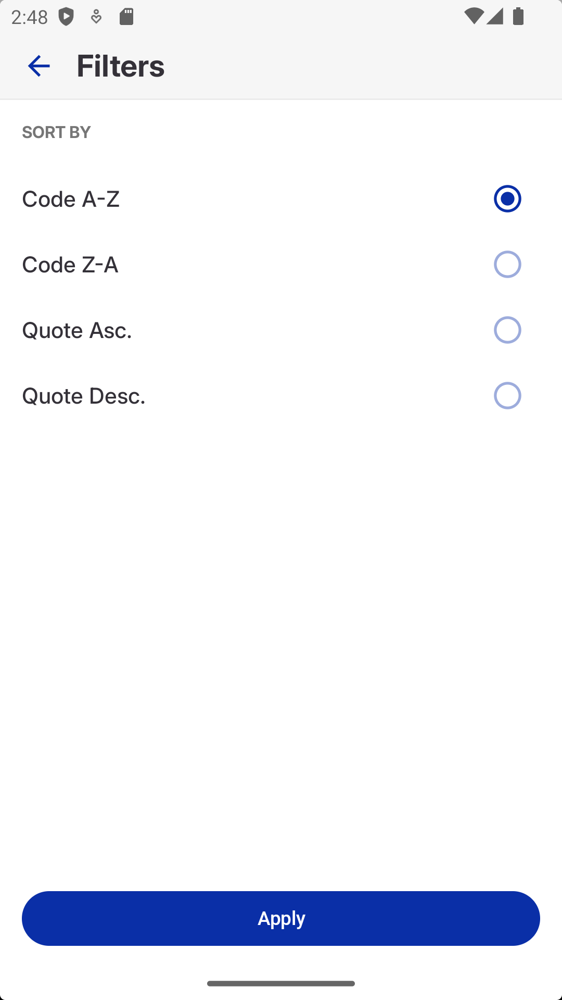
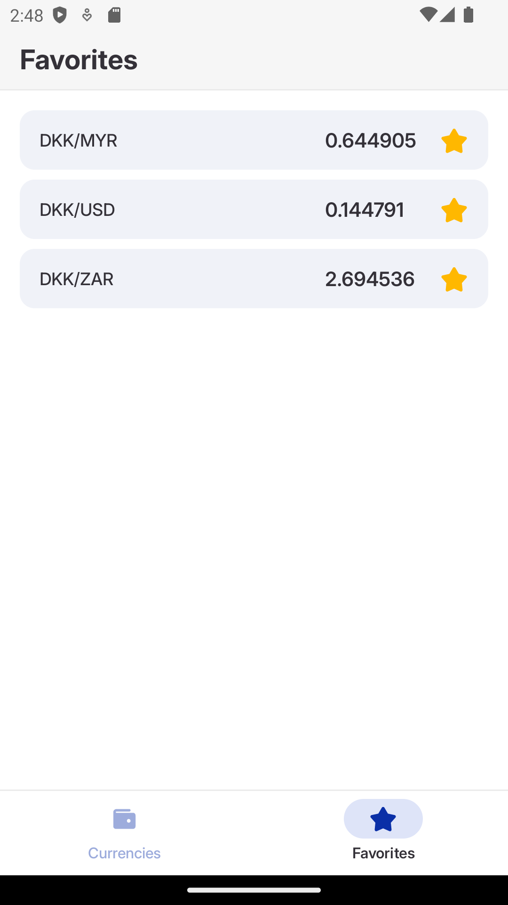

# Приложение "Отслеживание курсов валют".

## Основные функции:

1) Просмотр списка валют и их котировок:

- у пользователя есть возможность выбрать базовую валюту;
- приложение запоминает последнюю выбранную базовую валюту и отображает при последующем открытии;
- приложение загружает актуальные курсы валютных пар относительно выбранной базовой и отображает их в списке;
- пользователь может сортировать список валют по алфавиту или котировке (в порядке возрастания и убывания);

2) Добавление валютных пар в избранное:

- пользователь может добавить валютную пару в избранное по нажатию соответствующей кнопки в списке котировок;
- пользователь может управлять списком избранных валютных пар, просматривая их на отдельном экране.

## Экраны:

## API:

Для забора курсов валют использован API: https://vatcomply.com/.
Ресурс предоставляет курсы по версии European Central Bank.

## Стек технологий:

- Язык программирования: Kotlin;
- Асинхронные операции и управления потоками: Kotlin Coroutines;
- Хранения избранных валютных пар в виде базы данных: Room;
- Пользовательский интерфейс: Jetpack Compose;
- Внедрение зависимостей: Dagger 2;
- Сетевое взаимодействие: Retrofit + OkHttp.

## Архитектура:

- Архитектура приложения: single activity;
- Приложение поделено на модули: App, Features, Shared;
- Каждый модуль разбит на слои: Clean Arch;
- Архитектура слоя Presentation: MVI;

