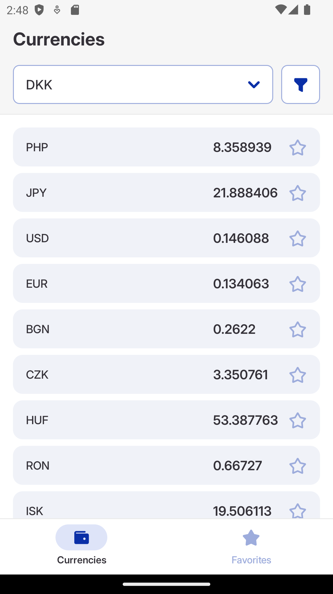
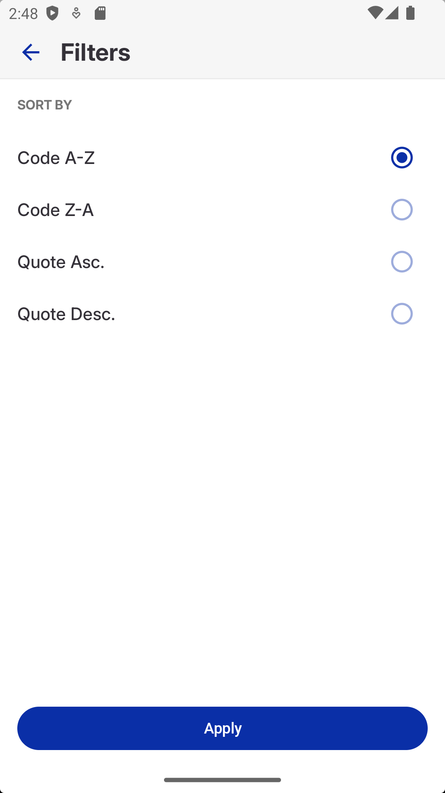
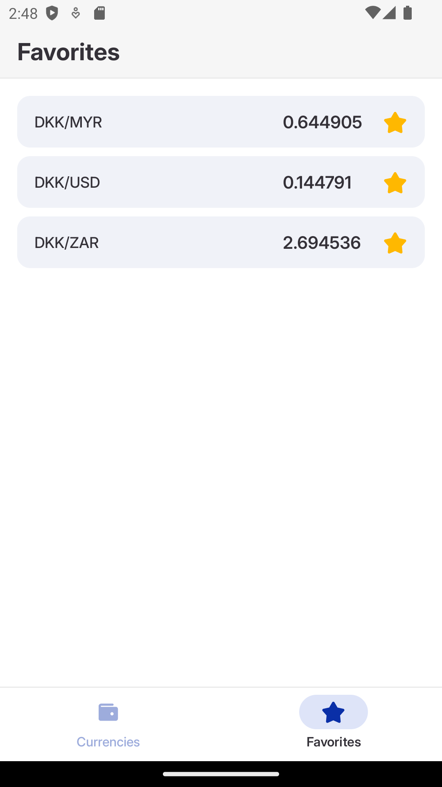

# Приложение "Отслеживание курсов валют".

## Основные функции:

1) Просмотр списка валют и их котировок:

- у пользователя есть возможность выбрать базовую валюту;
- приложение запоминает последнюю выбранную базовую валюту и отображает при последующем открытии;
- приложение загружает актуальные курсы валютных пар относительно выбранной базовой и отображает их в списке;
- пользователь может сортировать список валют по алфавиту или котировке (в порядке возрастания и убывания);

2) Добавление валютных пар в избранное:

- пользователь может добавить валютную пару в избранное по нажатию соответствующей кнопки в списке котировок;
- пользователь может управлять списком избранных валютных пар, просматривая их на отдельном экране.

## Экраны:

## API:

Для забора курсов валют использован API: https://vatcomply.com/.
Ресурс предоставляет курсы по версии European Central Bank.

## Стек технологий:

- Язык программирования: Kotlin;
- Асинхронные операции и управления потоками: Kotlin Flow;
- Хранения избранных валютных пар в виде базы данных: Room;
- Пользовательский интерфейс: Jetpack Compose;
- Внедрение зависимостей: Dagger 2;
- Сетевое взаимодействие: Retrofit + OkHttp.

## Архитектура:

- Архитектура приложения: single activity;
- Приложение поделено на модули: App, Features, Shared;
- Каждый модуль разбит на слои: Clean Arch;
- Архитектура слоя Presentation: MVI;

## Дополнение:

Приложение сделано для показа уровня разработчика, а не для выкладки в сторы.
Например добавление чистой архитектуры, многопоточности флоу и многомодульности в данном случае для такого маленького приложения из двух экранов в реальности будет избыточным решением, но добавлено именно для показа того, что разработчик обладает знаниями в данных технологиях. Тоже самое относится и к другим выбранным решениям.

Выбор некоторых решений основывался на том, что приложение разрабатывается (гипотетически) минимум 4 андроид разработчиками (2 команды по 2 разработчика). Каждая команда будет работать над своей изолированной фичей и не мешать другой команде. И поддержка приложения будет продолжительной.

Тем не менее я понимаю, что например архитектура многомодульности именно тут выбрана минимальная (без разбития фич на дополнительные отдельные модули). Тем не менее она подготовлена для последующих улучшений.

Кодстайл может не соответствовать вашему. Тем не менее я понимаю что он в каждой команде\компании свой и разработка ведется в соответственно ему.